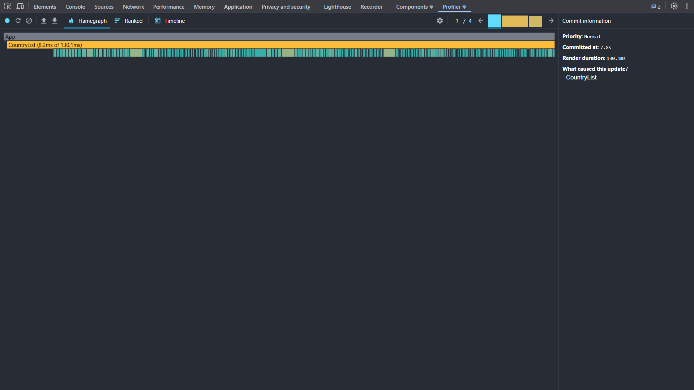
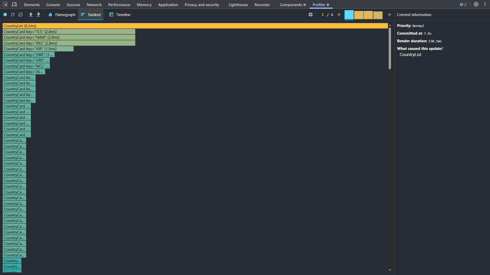
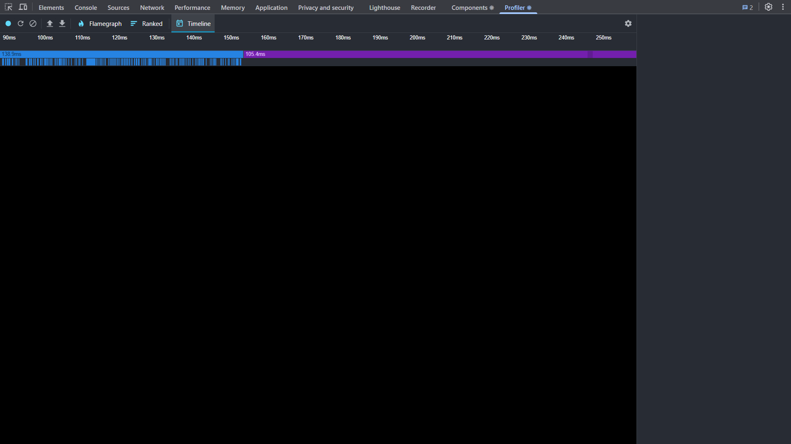
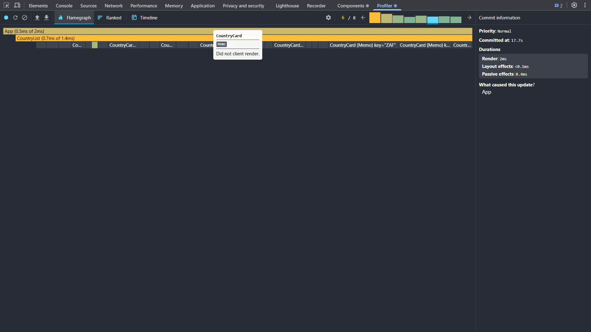
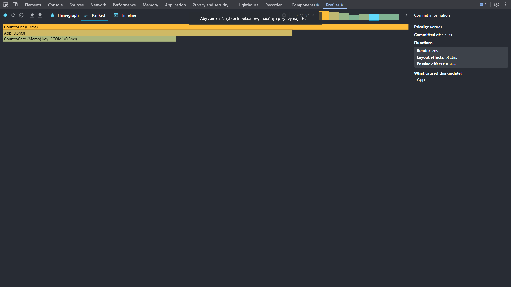
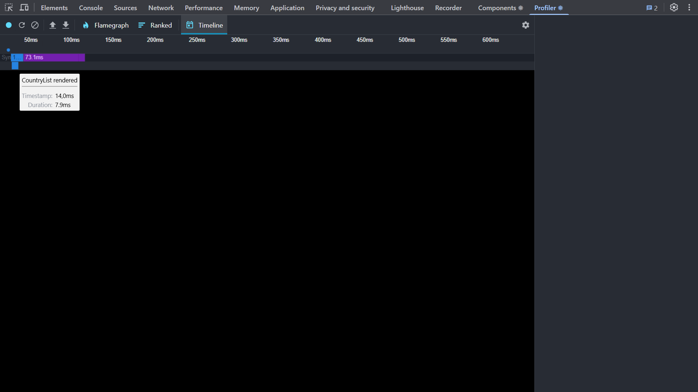

---

### Performance Profiling Task

#### Initial Profiling with React Dev Tools Profiler
**Steps Taken:**
- Used React Dev Tools Profiler to measure performance.
- Recorded interactions such as sorting a column.
- Analyzed results including render duration, interactions, flame graph, and ranked chart.

#### Performance Comparison Before & After Optimization

| Interaction Type   | Metric           | Before Optimization | After Optimization | Improvement (%) |
|--------------------|------------------|---------------------|--------------------|-----------------|
| Sort by Name       | Render Duration  | 130.1 ms            | 2 ms               | 98.46%          |
|                    | Renders          | 260                 | 4                  | 98.46%          |
| Sort by Population | Render Duration  | 130.1 ms            | 2 ms               | 98.46%          |
|                    | Renders          | 257                 | 4                  | 98.44%          |

#### Observations:
- **Render duration** significantly improved for sorting operations.
- Number of **unnecessary renders** drastically reduced.

#### Conclusion
Applying `React.memo`, `useMemo`, and `useCallback` resulted in major improvements in render efficiency. 
- `React.memo` prevented unnecessary re-renders.
- `useMemo` optimized expensive computations.
- `useCallback` memoized functions to prevent redundant re-creations.

Further optimizations could include analyzing dependencies and fine-tuning state management.

---

### Visual Comparison

#### Before Optimization:
- **Sort by Name**
- **Sort by Population**
  - 
  - 
  - 

  

#### After Optimization:
- **Sort by Name**
- **Sort by Population**
  - 
  - 
  - 

---

### Updated Measurements

#### Before Optimization:
- **Priority**: Normal
- **Committed at**: 7.8s
- **Render duration**: 130.1 ms
- **What caused this update?**: CountryList

#### After Optimization:
- **Priority**: Normal
- **Committed at**: 17.75
- **Render duration**: 2 ms
- **Layout effects**: <0.1 ms
- **Passive effects**: 0.4 ms

---

This updated report reflects the significant performance improvements achieved through optimization, with render duration reduced from 130.1 ms to 2 ms, and a corresponding reduction in the number of renders. The images are now linked using Markdown syntax for easy viewing in GitHub README or Markdown preview.